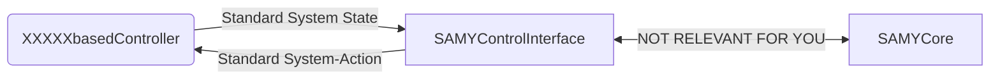
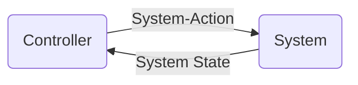

# SAMYControl
Control tools for the SAMYCore based on SAMYControlInterface

# SAMYControlInterface
## Basic idea
By means of a middleware (SAMYControlInterface) the developer of a controller can focus on the logic of the controller, and ignore implementation details regarding the SAMYCore.


## XXXXXbasedController
XXXXXbasedController inherits from SAMYControllerBase class, and XXXXX is the used approach to describe the desired behaviour of the system (so to say, XXXXX indicates the original controller description used as input by XXXXXbasedController).
Examples of such controllers are:
  - DTbasedController (XXXXX = DTControl): the input used for describing the controller/desired behaviour is a ".dot" file with the format used by DTControl to represent a decision tree 
  - PDDLbasedController (XXXXX = PDDL): the input used for describing the controller/desired behaviour are a PDDL domain, a PDDL problem, a PDDL plan (and an additional configuration file)
  - BPMNbasedController (XXXXX = BPMN): the input used for describing the controller/desired behaviour should be a SAMYBPMN file (and probbably an additional configuration file)

The XXXXXbasedController receives the system state from the SAMYControlInterface in a standardized form, and returns the next action to be performed by the system also described in a standardized form.
The SAMYControlInterface passes the new system state automatically to the XXXXXbasedController every time the system state changes, and every time expects to get a Standard System-Action as response. 

## SAMYControllerBase
All the controllers that use the SAMYControllerBase should inherit from SAMYControllerBase. SAMYControllerBase is a very basic class that enforces a certain pattern to be used in the XXXXXbasedController controller implementation.

### Control
Briefly stated, controlling a system consists in given the current state of the system, select the actions to be performed in order to reach the goal state. 
Control loop:

where the selection of actions should lead eventually to the desired goal state of the system. I will refer to the step performed by a controller for going from a system state to a system-action as a "prediction". 

```mermaid
flowchart LR
  subgraph Controller
      subgraph Predictor
            subgraph XXXXX
	    end
      end
  end
  System State --> XXXXX --> System-Action
```

This prediction takes place in an internal representation of states and system-actions depending on the type of XXXXX. For example, in its internal representation, DTControl uses an numpy array for the state and a tuple of strings for the system actions. PDDL uses an array of booleans (fluents) for representing the state, and a list of ad hoc created clases for representing the system-actions, which essentially are actions names with parameters names. 
In the case of BPMN it will used a ???dictionary??? for representing the state and ??? ad hoc created classes ??? for representing the system-actions.

Hence, a XXXXXbasedController to go from a Standard State to a Standard System-Action, must implement these three functions:
1.) standardStateToInternalState(standardState) -> returns a state in internal representation, given a state in standard representation
2.) predict(internalState) -> returns a system-action in internal representation, given a state in internal representation
3.) internalSystemActionToStandardSystemAction(internalAction) -> returns a standard system-action, given a system-action in internal representation
What they do is selfexplanatory. More details on them can be found in their prototypes appearing later, in the BPMNbasedController class defined under this comment.

SAMYControllerBase abstractly DEFINES these three functions (they cannot be pre-implemented, since they are XXXXX dependent), so you must implement them in the XXXXXbasedController.
Additionally, SAMYControllerBase IMPLEMENTS the so called "standardControlCallback" using these three functions. 
This "standardControlCallback(standardSystemState)" function is the function automatically called by the SAMYControlInterface every time the system state changes. 
This function takes as argument the system state in its standard representation, and returns a system-action in standard representation.
This standardControlCallback is provided to the SAMYControlInterface as a callback on instantiation of SAMYControlInterface class.

class SAMYControllerBase:
    def standardStateToInternalState(self, standardState): # To be implemented in XXXXXbasedController
	pass
    def predict(self, internalState): # To be implemented in XXXXXbasedController
	pass
    def internalSystemActionToStandardSystemAction(self, internalAction): # To be implemented in XXXXXbasedController
	pass
    def standardControlCallback(self, standardSystemState): # Already implemented, must NOT be implemented in XXXXXbasedController
        """
        Returns the next system action (SAMYSystemAction) to be performed, given the standard system state. 
        It is the method passed as control callback to the SAMYControlInterface
        """
        internalState = self.standardStateToInternalState(standardSystemState) # 1
        internalSystemAction = self.predict(internalState) # 2
        return self.internalSystemActionToStandardSystemAction( internalSystemAction ) #3

You do NOT have to do anything in the SAMYControllerBase.
