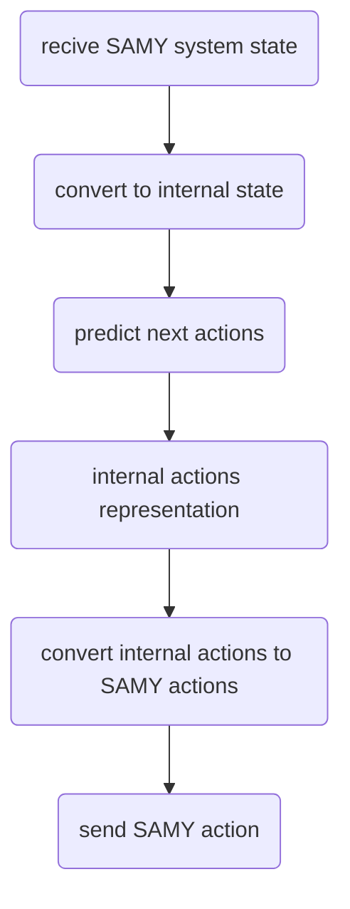
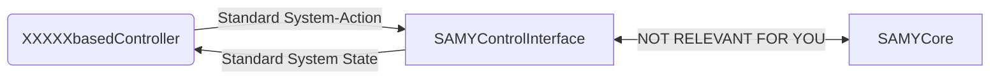
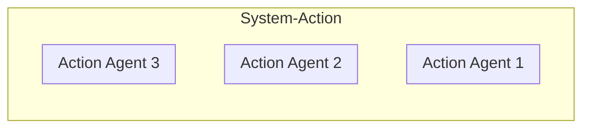
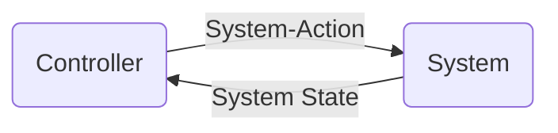
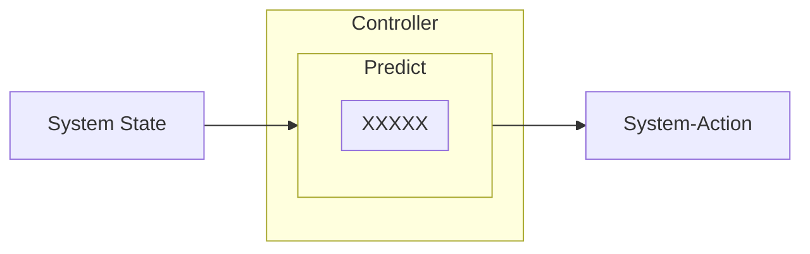
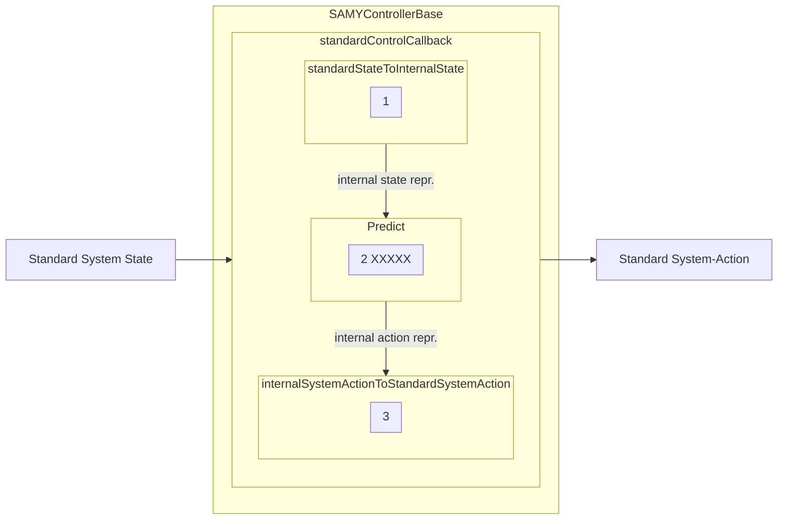

# SAMYControl
Control tools for the SAMYCore based on SAMYControlInterface.

# SAMYControlInterface
The SAMYControlInterface helps to implement controllers that use the SAMY framework to connect to the hardware. Controllers that use the SAMYControlInterface will be enforced to use a basic pattern as shown in the diagram below.



## Basic idea
By means of a middleware (SAMYControlInterface) the developer of a controller can focus on the logic of the controller (XXXXXbasedController), and ignore implementation details regarding the SAMYCore.


## SAMYControlInterface Implementation
The SAMYControlInterface, among other functionalities, connects to the SAMYCore, requests new actions every time the system state changes, inspects the SAMYCore information model, etc.. \
The API of the SAMYControlInterface is very simple. It just needs to be instantiated with three parameters:

1. Address of the SAMYCore
2. An array of node names that represent the SystemStatus. These nodes are provided by the SAMYCore depending on what agents (devices) are configured. There is on node for each agent that represents its status.
3. A standardControlCallback that "gives access" to the SAMYControlInterface to a control function (more on this later)

How to get the correct node names is not clear to me. Does the user have to do that or does the SAMYControlInterface do that automitically based on the configuration of the SAMYCore?

Once created, startSystemControl can be called, that optionally can contain the refresh rate in ms.

Two examples are:
```Python
# Controller Creation and setup
dtDotFileParser = DTControlDotFileParser.DTControlDotFileParser('/home/jbg/Desktop/SAMY/SAMYControl/UseCase1/UseCase1_Controller.dot')
controller = DTbasedController.DTbasedController(dtDotFileParser.root, dtDotFileParser.x_metadata, dtDotFileParser.y_metadata )


# ControlInterface creation and start of controlling
controlInterface = SAMYControlInterface.SAMYControlInterface( 'opc.tcp://localhost:4840/', controller.controlStateVariables, controller.standardControlCallback)
controlInterface.startSystemControl(100)
```

```Python
# Controller Creation and setup
controller = PDDLbasedController.PDDLbasedController('opc.tcp://localhost:4840/', '/home/jbg/Desktop/SAMY/SAMYControl/UseCases_PDDL/res/domain-res-strips.pddl', '/home/jbg/Desktop/SAMY/SAMYControl/UseCases_PDDL/res/problem-res-strips-1.pddl', '/home/jbg/Desktop/SAMY/SAMYControl/UseCases_PDDL/res/plan-res-strips-1-manual-human-ur10.plan')
value = input("Generate configuration template\n")
controller.generateConfigurationTemplate()
value = input("Press enter to read the configuration file\n")
controller.parseConfigFile()
value = input("Press enter to set up the controller\n")
controller.setupController()


# ControlInterface creation and start of controlling
controlInterface = SAMYControlInterface.SAMYControlInterface( 'opc.tcp://localhost:4840/', controller.getSystemStatusControlVariablesNames(), controller.standardControlCallback)
controlInterface.startSystemControl(100)
```


# SAMYControllerBase
All the controllers that use the SAMYControlInterface (from now on called XXXXXbasedControllers) should inherit from SAMYControllerBase. SAMYControllerBase is a very basic class that enforces a certain pattern to be used in the XXXXXbasedController controller implementation.

## Control
Briefly stated, controlling a system consists in receiving the current state of the system and then selecting the system actions to be performed in order to reach the goal state. In this context, we understand by system-action a set of individual actions, one for each agent in the system.
System-Action:


Control loop:

The selection of actions should lead eventually to the desired goal state of the system, while satisfying certain constraints in the intermediate states. I will refer to the step performed by a controller for going from a system state to a system-action as a "prediction".



This prediction takes place in an internal representation of states and system-actions depending on the type of controller. For example, in its internal representation, DTControl uses an numpy array for the state and a tuple of strings for the system actions. PDDL uses an array of booleans (fluents) for representing the state, and a list of ad hoc created clases for representing the system-actions, which essentially are names of actions with names of parameters.
In the case of BPMN it will used a ???dictionary??? for representing the state and ??? ad hoc created classes ??? for representing the system-actions.

## SAMYControllerBase Implementation
As previously stated, all the controllers that use the SAMYControlInterface (XXXXXbasedControllers) should inherit from SAMYControllerBase. SAMYControllerBase is a very basic class that enforces a certain pattern to be used in the XXXXXbasedController controller implementation. The SAMYControlInterface is the following:

```Python
class SAMYControllerBase:
    def standardStateToInternalState(self, standardState): # To be implemented in XXXXXbasedController
	pass
    def predict(self, internalState): # To be implemented in XXXXXbasedController
	pass
    def internalSystemActionToStandardSystemAction(self, internalAction): # To be implemented in XXXXXbasedController
	pass
    def standardControlCallback(self, standardSystemState): # Already implemented, must NOT be implemented in XXXXXbasedController
        """
        Returns the next system action (SAMYSystemAction) to be performed, given the standard system state.
        It is the method passed as control callback to the SAMYControlInterface
        """
        internalState = self.standardStateToInternalState(standardSystemState) # 1
        internalSystemAction = self.predict(internalState) # 2
        return self.internalSystemActionToStandardSystemAction( internalSystemAction ) #3
```


The pattern in the controllers enforced by this class is very simple:

 Three functions are required for going from a Standard State to a Standard System-Action, namely:

1. standardStateToInternalState(standardState) -> returns a state in internal representation, given a state in standard representation
2. predict(internalState) -> returns a system-action in internal representation, given a state in internal representation
3. internalSystemActionToStandardSystemAction(internalAction) -> returns a standard system-action, given a system-action in internal representation

SAMYControllerBase abstractly DEFINES these three functions (they cannot be pre-implemented, since they are XXXXX dependent), so XXXXXbasedController must implement them. What these three functions do is selfexplanatory.

Additionally, SAMYControllerBase IMPLEMENTS the so called "standardControlCallback" using these three functions.
This "standardControlCallback(standardSystemState)" function is the function automatically called by the SAMYControlInterface every time the system state changes.
This function takes as argument the system-state in its standard representation, and returns a system-action in standard representation.
This standardControlCallback is provided to the SAMYControlInterface as a callback on instantiation of SAMYControlInterface class.

**You do NOT have to do anything in the SAMYControllerBase!! Inherit from it to implement the XXXXXbasedController.**

# XXXXXbasedController
XXXXXbasedController inherits from SAMYControllerBase class and essentially implements the three functions required by the function "standardControlCallback(standardSystemState)" of SAMYControllerBase:

1. standardStateToInternalState(standardState) -> returns a state in internal representation, given a state in standard representation
2. predict(internalState) -> returns a system-action in internal representation, given a state in internal representation
3. internalSystemActionToStandardSystemAction(internalAction) -> returns a standard system-action, given a system-action in internal representation

XXXXX represents the used approach to describe the desired behaviour of the system (so to say, XXXXX indicates the original controller description used as input by XXXXXbasedController).
Examples of such controllers are:
  - DTbasedController (XXXXX = DTControl): the input used for describing the controller/desired behaviour is a ".dot" file with the format used by DTControl to represent a decision tree
  - PDDLbasedController (XXXXX = PDDL): the input used for describing the controller/desired behaviour are a PDDL domain, a PDDL problem, a PDDL plan (and an additional configuration file)
  - BPMNbasedController (XXXXX = BPMN): the input used for describing the controller/desired behaviour should be a SAMYBPMN file (and probbably an additional configuration file)

# Standard System State Representation and Standard System-Action Representation
## Standard System State Representation
The standard system state representation is a list of numerical and categorical (strings) values. The order of the elements in the list is given by the order specified when isntantiating the SAMYControlInterface.
Example:

```Python
standardState = [ 123.3, 65.2, "Alarm 1", "True", "False", 154.23 ]
```


## Standard System-Action Representation
The classes used for this, defined in SAMYControlInterface, are the following:
```Python
############# These classes are the objects required by the SAMYControlInterface to perform an action so refer to them as the standard representation of the actions.
# Hence, the "computed" actions by the SAMYControllers that are passed to the SAMYControlInterface must convert these actions first to these classes.

class SAMYActionParameter(): # A class containing describing a parameter of an action
    def __init__(self, skillParameterNumber_, valueType_ , value_):
        self.skillParameterNumber = skillParameterNumber_ # The command targeted by this parameter within a skill
        self.valueType = valueType_ # "DataBaseReference" or Other (the self.value will be string that will require be translated into a CRCLCommandParameterSet)
        self.value = value_ # The value of the parameter (can be a string than later on can be converted into a CRCLCommandParameterSet required by the
                            # skillParameterNumber using a CRCLCommandParameterSet that takes self.value as "metaparameter",
                            # or the self.value can be a reference to an element in the SAMYCore database (the name of the parameter stored there)


class SAMYAction: # A class describing a specific action to be performed by an agent
    def __init__(self, agentName_, skillName_, params_ = []):
        self.agentName = agentName_
        self.skillName = skillName_ # Name of the skill of the agent. In case nothing should be done with an agen, the name to use is "pass"
        self.params = params_ # An array of SAMYActionParameters


class SAMYSystemAction: # An action describing the action to be performed on the total system (an array of SAMYActions, one for each agent)
    def __init__(self, individualActionsArray):
        self.individualActions = individualActionsArray


#######################################################
```
